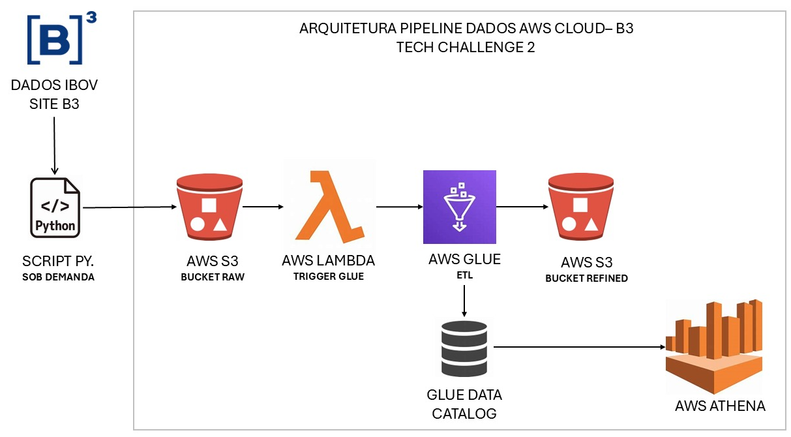

# Script de Conversão de CSV para Parquet e Upload para S3

Este script Python automatiza o processo de download de um arquivo CSV, sua conversão para o formato Parquet, e o upload do arquivo resultante para um bucket no Amazon S3. Ele faz parte de um pipeline de dados na AWS, conforme ilustrado na imagem abaixo:



## Descrição do Pipeline

O pipeline de dados descrito na imagem segue os seguintes passos:

1. **Dados IBOV (Site B3)**:
   - Os dados são obtidos do site da B3, que fornece informações sobre o Índice Bovespa (IBOV).
   - Um **script Python** é executado sob demanda para baixar o arquivo CSV contendo os dados.

2. **AWS S3 (Bucket RAW)**:
   - O arquivo CSV é convertido para o formato Parquet e enviado para um bucket S3 chamado `raw`.
   - Este bucket armazena os dados brutos antes de qualquer processamento.

3. **AWS Lambda (Trigger Glue)**:
   - Um gatilho (trigger) é acionado no AWS Lambda sempre que um novo arquivo é adicionado ao bucket `raw`.
   - O Lambda inicia um job no AWS Glue para processar os dados.

4. **AWS Glue (ETL)**:
   - O AWS Glue realiza a transformação dos dados (ETL - Extract, Transform, Load).
   - Os dados são limpos, transformados e preparados para análise.

5. **AWS S3 (Bucket REFINED)**:
   - Após o processamento, os dados refinados são armazenados em outro bucket S3 chamado `refined`.

6. **Glue Data Catalog**:
   - O AWS Glue Data Catalog é atualizado com os metadados dos dados refinados, facilitando a consulta e análise.

7. **AWS Athena**:
   - O AWS Athena é utilizado para consultar os dados refinados diretamente do bucket `refined`, sem a necessidade de infraestrutura adicional.

## Bibliotecas Utilizadas

- **requests**: Para fazer requisições HTTP e baixar o arquivo CSV.
- **pandas**: Para manipulação e limpeza dos dados.
- **pyarrow**: Para conversão do DataFrame para o formato Parquet.
- **boto3**: Para interagir com o Amazon S3 e fazer o upload do arquivo.
- **unidecode**: Para normalizar caracteres Unicode.

## Como Utilizar

1. **Instalação das Dependências**: Certifique-se de ter todas as bibliotecas necessárias instaladas. Você pode instalá-las usando pip:
   ```bash
   pip install requests pandas pyarrow boto3 unidecode