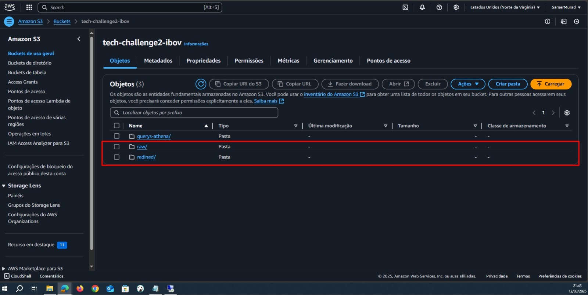
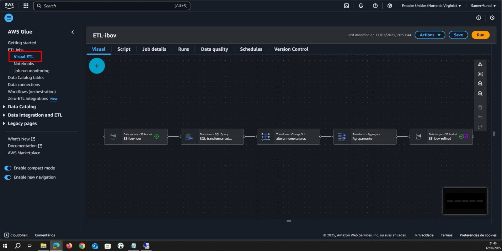
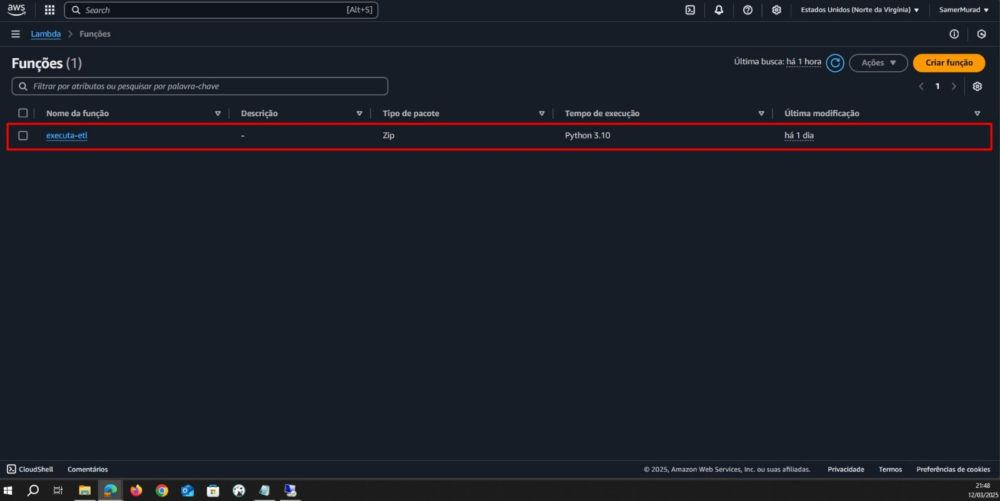
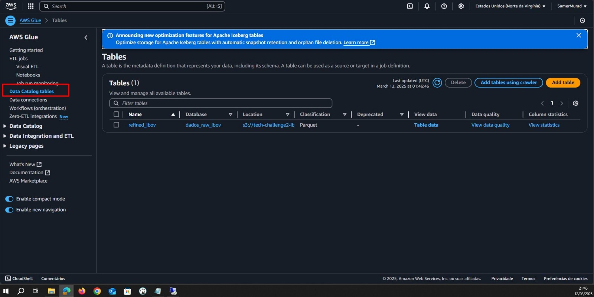
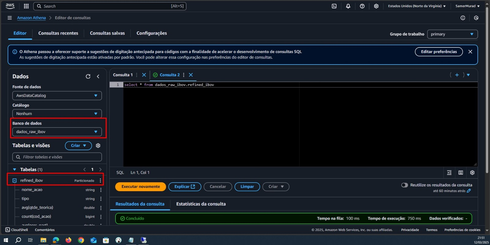

# Script de Conversão de CSV para Parquet e Upload para S3

Este script faz parte da entrega do segundo desafio do MBA Fiap. 
O desafio consiste em fazer o download de um arquivo csv, converte-lo em parquet e envia-lo para um bucket s3 onde será tratado. 
Seguiremos o pipeline abaixo:


## Descrição do Pipeline

O pipeline de dados descrito na imagem segue os seguintes passos:

1. **Dados IBOV (Site B3)**:
   - Os dados são obtidos do site da B3, que fornece informações sobre o Índice Bovespa (IBOV).
   - **script Python** é executado sob demanda para baixar o arquivo CSV contendo os dados, em seguida é convertido para .parquet e feito o upload para o S3

2. **AWS S3 (Bucket RAW)**:
   - O convertido é enviado para uma pasta no bucket S3 chamada `raw`.
   - Este bucket armazena os dados brutos antes de qualquer processamento.

3. **AWS Lambda (Trigger Glue)**:
   - Um trigger é acionado no AWS Lambda sempre que um novo arquivo é adicionado a pasta `raw` e seja do formato `parquet`
   - O Lambda inicia um job no AWS Glue para processar os dados.

4. **AWS Glue (ETL)**:
   - O AWS Glue realiza o ETL dos dados.

5. **AWS S3 (Bucket REFINED)**:
   - Após o processamento, os dados refinados são armazenados em outro bucket S3 chamado `refined`.

6. **Glue Data Catalog**:
   - O AWS Glue Data Catalog é atualizado com os metadados dos dados refinados, facilitando a consulta e análise.

7. **AWS Athena**:
   - O AWS Athena é utilizado para consultar os dados refinados diretamente do bucket `refined`, sem a necessidade de infraestrutura adicional.

## Bibliotecas Utilizadas

- **requests**: Para fazer requisições HTTP e baixar o arquivo CSV.
- **pandas**: Para manipulação e limpeza dos dados.
- **pyarrow**: Para conversão do DataFrame para o formato Parquet.
- **boto3**: Para interagir com o Amazon S3 e fazer o upload do arquivo.
- **unidecode**: Para normalizar caracteres Unicode.

## Como Utilizar

1. **Instalação das Dependências**: Certifique-se de ter todas as bibliotecas necessárias instaladas. Você pode instalá-las usando pip:
   ```bash
   pip install requests pandas pyarrow boto3 unidecode

## Evidências AWS

  
*Figura 1: Bucket S3 criado e suas pastas.*

  
*Figura 2: Glue ETL criado.*

  
*Figura 3: Lambda criada.*

  
*Figura 4: Data Catalog no Glue.*

  
*Figura 5: Consumo dos dados tratados na Athena.*